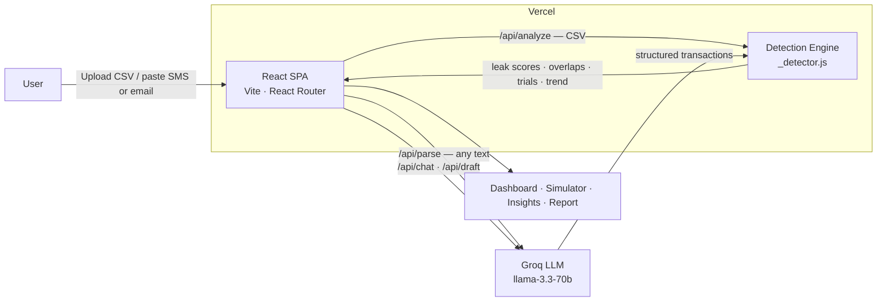

<div align="center">

# 🧟 Zombii

### *Find the money you're silently losing — and get it back.*

**Every other app tells you where your money leaks. Zombii hunts down the wasted money and helps you claw it back.**

An AI-powered subscription-leak detector: it scans your bank statement, SMS, or email,
finds every recurring charge, catches silent price hikes and zombie (unused) subscriptions,
scores the leak, and drafts the cancellation email for you.

`FinTech` · `Agentic AI` · `React` · `Vercel Serverless` · `Groq LLM`

[**🔗 Live Demo**](https://zombii.vercel.app) · [Features](#-features) · [Architecture](#-architecture) · [Run locally](#-run-locally)

</div>

---

## 🎯 The problem

> *Most people are quietly losing money every month to subscriptions they forgot about,
> price hikes they never noticed, and services they no longer use — buried inside cluttered
> bank statements, SMS alerts, and email inboxes that no one has time to review line by line.*
> — InnovaHack FinTech, Problem Statement 1

The average person leaks **thousands of rupees a year** to subscriptions on autopilot. The
information to stop it is already in their bank statement — it's just unreadable.

## 💡 The solution

Zombii turns an unreadable statement into a ranked, actionable plan in seconds — and then
takes the action for you.

| Brief requirement | How Zombii delivers it |
|---|---|
| Detect recurring subscriptions from unstructured data | Merchant-cleaning + cadence analysis (monthly/weekly/quarterly/yearly); **agentic LLM parsing** for any statement, SMS, or email format |
| Flag silent price increases | Relative-jump **and** statistical **z-score anomaly** detection over charge history |
| Identify unused subscriptions | "Zombie" detection from stale-charge patterns |
| Present a clear leak score | 0–100 leak score per subscription + an overall gauge, with category cost visualization |
| Actionable, per-subscription guidance | Cancel / downgrade / renegotiate plan + **AI-drafted emails** you can send in one tap |

## ✨ Features

**Detection & intelligence**
- 🔁 **Recurring-charge detection** from messy statement lines, with a **confidence score** per subscription
- 📈 **Silent price-hike alerts** using statistical anomaly (z-score) detection
- 🧟 **Zombie detection** — subscriptions that quietly kept charging after you stopped using them
- 🔀 **Overlap detector** — duplicate services in the same category (waste money-only tools miss)
- 🛡️ **Trial Guardian** — predicts free trials about to auto-convert to paid, *before* they charge
- ⚡ **Agentic parsing** — paste any statement / SMS / email; the LLM structures it automatically

**Act, don't just advise**
- ✍️ **AI-drafted emails** — cancellation *and* discount-negotiation variants, ready to send (`mailto:`)
- 💥 **Kill-all zombies** — cancel every dead subscription in one tap
- 💬 **Ask Zombii** — a voice-enabled AI assistant grounded in your real data

**Insight & delight**
- 🚀 **Leak → Wealth simulator** — what your wasted money becomes if invested instead
- 🛰️ **Renewal Radar** — predicts each subscription's next charge date
- 📊 **Benchmark** — how your waste compares to the average person
- 📄 **Printable PDF report** · 📸 **Shareable leak card** · 🌙 **Dark/light themes** · 🧟 **Reactive mascot**

## 🏗️ Architecture



- **Frontend** — React + Vite SPA, React Router, dependency-free SVG charts, CSS animations.
- **Backend** — Vercel serverless functions (`/api/*`). The detection engine is pure, testable JS.
- **AI** — Groq (`llama-3.3-70b-versatile`) for agentic parsing, chat, and email drafting.
- **Privacy** — statements are analysed on-demand and **never stored**.

## 🧠 How detection works

1. **Clean** — strip UPI/POS/gateway junk from each transaction to a real merchant name.
2. **Group & measure cadence** — bucket charges by merchant, measure the gaps; regular gaps = recurring.
3. **Score confidence** — from charge count + gap regularity (coefficient of variation).
4. **Flag anomalies** — price hikes via relative jump *or* z-score outlier; zombies via stale charges.
5. **Rank & act** — compute a leak score, overlap waste, trial risk, and a per-subscription action plan.

## 🛠️ Tech stack

| Layer | Tech |
|---|---|
| Frontend | React 18, Vite, React Router, custom SVG charts, Canvas |
| Backend | Vercel Serverless Functions (Node, ESM) |
| AI | Groq API — `llama-3.3-70b-versatile` |
| Testing | Node built-in test runner (`node --test`) |
| Deploy | Vercel (single project, frontend + `/api`) |

## 🚀 Run locally

```bash
git clone https://github.com/<you>/zombii
cd zombii
npm install
cp .env.example .env      # add your Groq key
npm i -g vercel
vercel dev                # http://localhost:3000 — /api routes work here
```

> Use `vercel dev` (not `npm run dev`) so the serverless `/api` routes resolve.
> Loads a demo statement automatically; pick a persona or paste your own.

**Run the tests**
```bash
npm test                  # 10 passing — engine detection assertions
```

## ☁️ Deploy

1. Push to GitHub → import the repo on [vercel.com](https://vercel.com) (framework auto-detects **Vite**).
2. Add `GROQ_API_KEY` in **Settings → Environment Variables**.
3. Deploy — one URL serves the app *and* the `/api` functions.

## 📈 Scalability & real-world impact

- **Stateless serverless** — no per-user infrastructure; scales horizontally on demand.
- **Production path** — live transaction sync via India's **Account Aggregator** framework (or Plaid).
- **Business model** — freemium: free scanning, paid auto-negotiation & continuous monitoring.
- **Roadmap** — live bank sync → autonomous negotiation agent → WhatsApp bank-SMS bot → multi-currency.

## 🔒 Privacy & security

- Statements are parsed on-demand and **never persisted** server-side.
- API endpoints validate input, cap payload size, and reject malformed requests.
- Secrets live only in environment variables (`.env` is gitignored).

## 📁 Project structure

```
zombii/
├── api/               Serverless functions + detection engine
│   ├── _detector.js   Core engine (recurrence, anomaly, zombie, overlap, trial)
│   ├── _samples.js    Demo personas
│   ├── _guard.js      Request validation
│   ├── analyze.js · parse.js · chat.js · draft.js · demo.js · samples.js
├── src/               React app (pages/ + components/)
├── test/              Engine unit tests
└── README.md
```

---

<div align="center">

Built for **InnovaHack Chapter-1** · *Kill the subscriptions draining you.* 🧟

</div>
